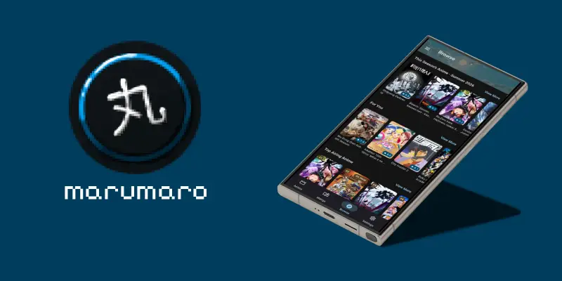

    
     
    A simple MyAnimeList client for viewing and updating your anime and manga lists.

## Screenshots

  
  
  

## Features

- Sign in with your MyAnimeList account
- Offline-first cached lists that sync with MAL
- Search for anime and manga
- Browse seasonal anime, personalized suggestions, and rankings (airing, upcoming, top manga, etc.)
- Edit status, score, and progress, as well as advanced stats like date started/finished, tags, comments, and more
- Light, dark, and AMOLED themes with sortable lists
